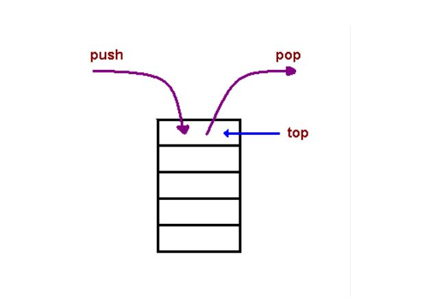

# In memory storage

1- What is a ‘call’?

Its function invocation.

2- What does LIFO mean?

Last In, First Out

3- Draw an example of a call stack and the functions that would need to be invoked to generate that call stack.



4- What causes a Stack Overflow?

A stack overflow occurs when there is a recursive function (a function that calls itself) without an exit point.

5- What is a ‘refrence error’?

when you try to use a variable that is not yet declared you get this type os errors.

6- What is a ‘syntax error’?

this occurs when you have something that cannot be parsed in terms of syntax.


7- What is a ‘range error’?

When you Try to manipulate an object with some kind of length and give it an invalid length .

8- What is a ‘type error’?

This types of errors show up when the types (number, string and so on) you are trying to use or access are incompatible, like accessing a property in an undefined type of variable.

9- What is a breakpoint?

Its a point in the code, which will make your program stop at that point and help you debugg your code at that point.

10- What does the word ‘debugger’ do in your code?

It adds a breakpoint at that line, then you can walk through your code from that point step-by-step.


## Call Stack

The call stack is primarily used for function invocation (call). Since the call stack is single, function(s) execution, is done, one at a time, from top to bottom. It means the call stack is synchronous.

A call stack is a data structure that uses the Last In, First Out (LIFO) principle to temporarily store and manage function invocation (call).

```
function firstFunction(){
  throw new Error('Stack Trace Error');
}

function secondFunction(){
  firstFunction();
}

function thirdFunction(){
  secondFunction();
}

thirdFunction();
```

You will notice that the arrangement of the functions as a stack begins with the `firstFunction()` (which is the last function that got into the stack, and is popped out to throw the error), followed by the `secondFunction()`, and then the `thirdFunction()` (which is the first function that gets pushed into the stack when the code is executed).

**Temporarily store**: When a function is invoked (called), the function, its parameters, and variables are pushed into the call stack to form a stack frame. This stack frame is a memory location in the stack. The memory is cleared when the function returns as it is pop out of the stack.

A __stack overflow__ occurs when there is a recursive function (a function that calls itself) without an exit point. The browser (hosting environment) has a maximum stack call that it can accomodate before throwing a stack error.

```
function callMyself(){
  callMyself();
}

callMyself();
```

## JavaScript error messages && debugging

### Types of error messages

- Reference errors

This is as simple as when you try to use a variable that is not yet declared you get this type os errors.

```
console.log(foo) // Uncaught ReferenceError: foo is not defined
```

This is also a common thing when using const and let, they are hoisted like var and function but there is a time between the hoisting and being declared so when you try to access them a reference error occurs, the fact that this happens to let and const is called Temporal Dead Zone (TDZ).

```
foo = 'Hello' // Uncaught ReferenceError: foo is not defined
let foo
```
- Syntax errors

this occurs when you have something that cannot be parsed in terms of syntax, like when you try to parse an invalid object using JSON.parse.

```
JSON.parse( {'foo': 'bar'} ) // Uncaught SyntaxError: Unexpected token o in JSON at position 1
```

- Range errors

Try to manipulate an object with some kind of length and give it an invalid length and this kind of errors will show up.

```
var foo= []
foo.length = foo.length -1 // Uncaught RangeError: Invalid array length
```


- Type errors

Like the name indicates, this types of errors show up when the types (number, string and so on) you are trying to use or access are incompatible, like accessing a property in an undefined type of variable.

```
var foo = {}
foo.bar // undefined
foo.bar.baz // Uncaught TypeError: Cannot read property 'baz' of undefined
```

### Debugging 

To debug your JS code, the easiest and maybe the most common way its to simply console.log() the variables you want to check or, by using chrome developer tools, open your page with your JS code (press cmd+o in macOS or Ctrl+o in Windows) and choose your file to debug, click the line you wanna debug and refresh your page again (F5).
If the line you selected was run you will be able to see what has happened before that point and you can try and evaluate the next lines to check if everything is outputting what you are expecting.

The breakpoint can also be achieved by putting a debugger statement in your code in the line you want to break.


### Handling errors

we usually try to catch the errors so we can gracefully fallback to a default state of our application in case of an error.

```
(function testing(){
  function add(a, b) {
    try {
      var result = a + b
      return result.split('')
    } catch (error) {
      console.error('add went wrong ->', error)
      return [] // default value
    }
  }
  var stringResult = add("1", "2")
  var numberResult = add(1, 2)
})()
```

The worthiest outcome of using try…catch tough is the fact that your application will keep on running.


