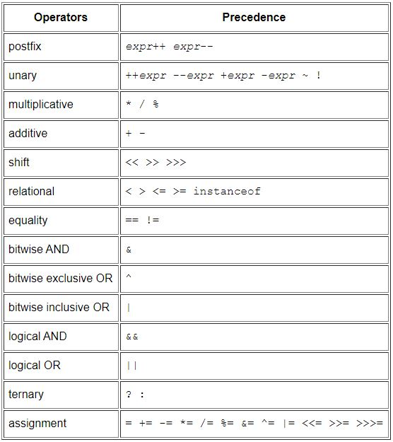

# Language Basics

## Variables

In Java language, the terms "field" and "variable" refer to the same thing and they are both used.

### Kinds of variables in Java programming language:

- Instance Variables (Non-Static Fields): known as _instance variables_ because their values are unique to each instance of class (or to each object), which they are fields declared without the `static` keyword.

- Class Variables (Static Fields): Any field declared using `static` keyword, regardless of how many times the class has been instantiated, there will be exactly one copy of this variable in existance.

- Local Variables: Variables where methods store its temporary state. The syntax for declaring a local variable is similar to declaring a field (`int count = 0;`). local variables are only visible to the methods in which they are declared.

- Parameters: parameters are always classified as "variables" not "fields", and they are located inside of the paranthesis of the class.

### Variables naming rules in Java:

- Variable names are case-sensitive. A variable's name can be any legal identifier an unlimited-length sequence of Unicode letters and digits, beginning with a letter, the dollar sign "$", or the underscore character "_".

- Subsequent characters may be letters, digits, dollar signs, or underscore characters. Conventions (and common sense) apply to this rule as well. Also the name must not be a keyword or reserved word.

- If the name you choose consists of only one word, spell that word in all lowercase letters. If it consists of more than one word, capitalize the first letter of each subsequent word. The names `gearRatio` and `currentGear` are prime examples of this convention. If your variable stores a constant value, such as `static final int NUM_GEARS = 6`, the convention changes slightly, capitalizing every letter and separating subsequent words with the underscore character. By convention, the underscore character is never used elsewhere.

## Operators

Operators are special symbols that perform specific operations on one, two, or three _operands_, and then return a result.

The operators in the following table are listed according to precedence order. The closer to the top of the table an operator appears, the higher its precedence. Operators with higher precedence are evaluated before operators with relatively lower precedence.




## Expressions

An expression is a construct made up of variables, operators, and method invocations, that evaluates to a single value.

The data type of the value returned by an expression depends on the elements used in the expression. The Java programming language allows you to construct compound expressions from various smaller expressions as long as the data type required by one part of the expression matches the data type of the other.

## Statements

Statements are roughly equivalent to sentences in natural languages. A statement forms a complete unit of execution.

There are three types of statements:

- Expression statements, which includes:

    - Assignment expressions
    - Increment statements
    - Method invocations
    - object creation expressions

- Declaration statement: declares a variable.
- Control flow statements: regulate the order in which statements get executed.

## Blocks

A block is a group of zero or more statements between balanced braces and can be used anywhere a single statement is allowed.

```
class BlockDemo {
     public static void main(String[] args) {
          boolean condition = true;
          if (condition) { // begin block 1
               System.out.println("Condition is true.");
          } // end block one
          else { // begin block 2
               System.out.println("Condition is false.");
          } // end block 2
     }
}
```