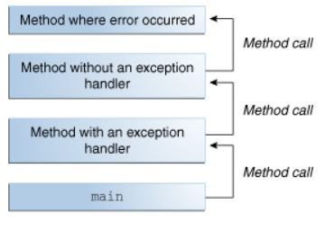

# Java Primitives versus Objects

Java has a two-fold type system:

- primitives such as int, boolean

- reference types such as Integer, Boolean

Every primitive type corresponds to a reference type.

The process of converting a primitive type to a reference one is called autoboxing, the opposite process is called unboxing.

```
Integer j = 1;          // autoboxing
int i = new Integer(1); // unboxing
```
## Pros and Cons

### Single Item Memory Footprint

 Primitive type variables have the following impact on the memory:

- boolean – 1 bit
- byte – 8 bits
- short, char – 16 bits
- int, float – 32 bits
- long, double – 64 bits

Variables of these types live in the stack and hence are accessed fast.

While the reference types are objects, they live on the heap and are relatively slow to access.

- Boolean – 128 bits
- Byte – 128 bits
- Short, Character – 128 bits
- Integer, Float – 128 bits
- Long, Double – 192 bits


### Memory Footprint for Arrays

Surprisingly, arrays of the primitive types long and double consume more memory than their wrapper classes Long and Double.

We can see either that single-element arrays of primitive types are almost always more expensive (except for long and double) than the corresponding reference type.


### Performance

The performance of a Java code is quite a subtle issue, it depends very much on the hardware on which the code runs, on the compiler that might perform certain optimizations, on the state of the virtual machine, on the activity of other processes in the operating system.

Operations for primitive types are faster than those for wrapper classes.


### Default Values

Default values of the primitive types are 0 for numeric types, false for the boolean type, \u0000 for the char type. For the wrapper classes, the default value is null.

### Usage

Current Java language specification doesn't allow usage of primitive types in the parametrized types (generics),  in the Java collections or the Reflection API.

When our application needs collections with a big number of elements, we should consider using arrays with as more “economical” type as possible, as it's illustrated on the plot above.


# Exceptions 

An exception is an event, which occurs during the execution of a program, that disrupts the normal flow of the program's instructions.

When an error occurs within a method, the method creates an object and hands it off to the runtime system. The object, called an **exception object**, contains information about the error, including its type and the state of the program when the error occurred. Creating an exception object and handing it to the runtime system is called **throwing an** **exception**.


After a method throws an exception, the runtime system attempts to find something to handle it. The set of possible "somethings" to handle the exception is the ordered list of methods that had been called to get to the method where the error occurred. The list of methods is known as the _call stack_.




The runtime system searches the call stack for a method that contains a block of code that can handle the exception. This block of code is called an *exception handler*.

The search begins with the method in which the error occurred and proceeds through the call stack in the reverse order in which the methods were called.
if it doesn't find an appropriate exception handler after searching all methods, the runtime system terminates.

## The Catch or Specify Requirements 

The code that might throw certain exceptions must be enclosed by either of the following:

- A try statement that catches the exception. The try must provide a handler for the exception.

- A method that specifies that it can throw the exception. The method must provide a throws clause that lists the exception


Not all exceptions are subject to the Catch or Specify Requirement. There are three basic categories of exceptions, only one of which is subject to the Requirement.

1- The first kind of exception is the checked exception. All exceptions are checked exceptions, except for those indicated by Error, RuntimeException, and their subclasses.

Checked exceptions are subject to the Catch or Specify Requirement.

2- The second kind of exception is the error. These are exceptional conditions that are external to the application, and that the application usually cannot anticipate or recover from. 

Errors are not subject to the Catch or Specify Requirement. Errors are those exceptions indicated by Error and its subclasses.

3- The third kind of exception is the runtime exception. These are exceptional conditions that are internal to the application, and that the application usually cannot anticipate or recover from. These usually indicate programming bugs, such as logic errors or improper use of an API.

Runtime exceptions are not subject to the Catch or Specify Requirement. Runtime exceptions are those indicated by RuntimeException and its subclasses.

Errors and runtime exceptions are collectively known as _unchecked exceptions_.


# Scanning 

Objects of type Scanner are useful for breaking down formatted input into tokens and translating individual tokens according to their data type.

By default, a scanner uses white space to separate tokens. (White space characters include blanks, tabs, and line terminators)

Scanner supports tokens for all of the Java language's primitive types (except for char).

