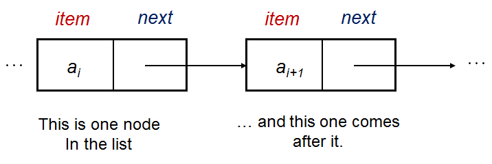

# Linked Lists

I'm gonna create a vocabulary/definition list as my way of teaching:

1- Linked Lists : Linked List is a data structure, part of the Collection framework present in java.util package. This class is an implementation of the LinkedList data structure which is a linear data structure where every element is a separate object with a data part and address part. Each element is known as a node.

2- Singly:  refers to the number of reference (link) a node has, in singly we can add or remove elements from one side which is next element.

3- Doubly: Also refers to the number of reference (link) a node has, but in doubly we can add or remove elements from both sides.

4- Node: nodes are like containers, in which we store our elements inside and has links to other nodes.

5- Head: Head refers to the first node in the list.

6- Current: refers to current node we looking at. when we to visit every node we create a new `Current` variable to make sure we are starting from the beginning of the linked list.

7- Traversing: basically means visiting every node we have in the linked list, and we depend on for that `Next` value in each note to guide us where the next reference is pointing to.