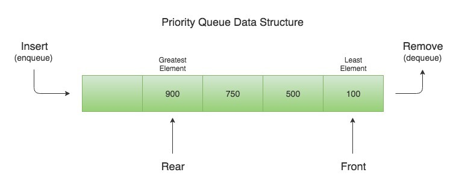

# Stack 

Terminology:

- Push : Elements that are added on top of the `stack`.

- Pop: Elements that are removed from the top of the `stack`.

- Top : First element in `stack`, which is located in top of `stack`.

- Peek : Get the value of the `Top` of the `stack`.

- IsEmpty : A boolean, Checks whether a `stack` is empty or not.

# Queue

Terminology:

- Enqueue : Elements that are added to `queue`.

- Dequeue : Elements that are removed from `queue`.

- Front : The first element in `queue` which comes at the front.

- Rear :  The last element in `queue` which comes at the back.

- Peek : Get the value of the `Front` element.

- IsEmpty : A boolean, Checks whether a `queue` is empty or not.

