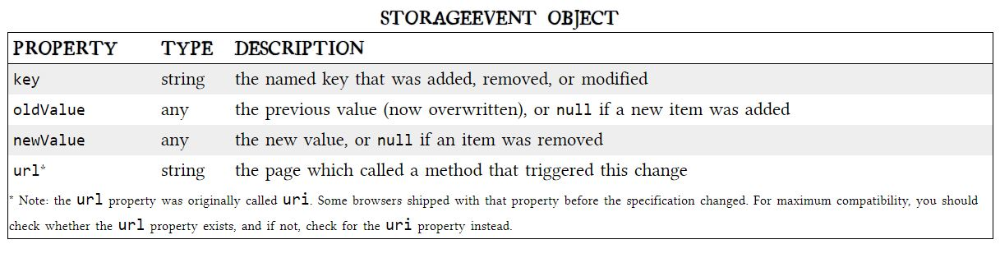

# Local Storage for Web Applications

## A BRIEF HISTORY OF LOCAL STORAGE HACKS BEFORE HTML5

In the beginning, there was only Internet Explorer. Microsoft invented a great many things and included them in their browser, Internet Explorer. One of these things was called DHTML Behaviors, and one of these behaviors was called __userData__.


__userData__ allows web pages to store up to 64 KB of data per domain, in a hierarchical XML-based structure. (Trusted domains, such as intranet sites, can store 10 times that amount.) IE does not present any form of permissions dialog, and there is no allowance for increasing the amount of storage available.

In 2002, Adobe introduced a feature in Flash 6 that gained the unfortunate and misleading name of “Flash cookies.” Within the Flash environment, the feature is properly known as __Local Shared Objects__. Briefly, it allows Flash objects to store up to 100 KB of data per domain.

As you survey these solutions, a pattern emerges: all of them are either specific to a single browser, or reliant on a third-party plugin. Despite heroic efforts to paper over the differences, they all expose radically different interfaces, have different storage limitations, and present different user experiences. So this is the problem that HTML5 set out to solve: to provide a standardized API, implemented natively and consistently in multiple browsers, without having to rely on third-party plugins.

## INTRODUCING HTML5 STORAGE

HTML5 Storage, it’s a way for web pages to store named key/value pairs locally, within the client web browser. Like cookies, this data persists even after you navigate away from the web site, close your browser tab, exit your browser, or what have you. Unlike cookies, this data is never transmitted to the remote web server (unless you go out of your way to send it manually). Unlike all previous attempts at providing persistent local storage, it is implemented natively in web browsers, so it is available even when third-party browser plugins are not.
Which browsers? Well, the latest version of pretty much every browser supports HTML5 Storage… even Internet Explorer!


From your JavaScript code, you’ll access HTML5 Storage through the localStorage object on the global window object. Before you can use it, you should detect whether the browser supports it:

```
function supports_html5_storage() {
  try {
    return 'localStorage' in window && window['localStorage'] !== null;
  } catch (e) {
    return false;
  }
}
```
Instead of writing this function yourself, you can use Modernizr to detect support for HTML5 Storage:

```
if (Modernizr.localstorage) {
  // window.localStorage is available!
} else {
  // no native support for HTML5 storage :(
  // maybe try dojox.storage or a third-party solution
}
```

## USING HTML5 STORAGE

HTML5 Storage is based on named key/value pairs. You store data based on a named key, then you can retrieve that data with the same key. The named key is a string. The data can be any type supported by JavaScript, including strings, Booleans, integers, or floats. However, the data is actually stored as a string. If you are storing and retrieving anything other than strings, you will need to use functions like __parseInt__() or __parseFloat__() to coerce your retrieved data into the expected JavaScript datatype.


Like other JavaScript objects, you can treat the localStorage object as an associative array. For example, this snippet of code:
```
var foo = localStorage["bar"];
// ...
localStorage["bar"] = foo;
```

There are also methods for removing the value for a given named key, and clearing the entire storage area (that is, deleting all the keys and values at once):
```
interface Storage {
  deleter void removeItem(in DOMString key);
  void clear();
};
```
Calling __removeItem__() with a non-existent key will do nothing.


Finally, there is a property to get the total number of values in the storage area, and to iterate through all of the keys by index (to get the name of each key):
```
interface Storage {
  readonly attribute unsigned long length;
  getter DOMString key(in unsigned long index);
};
```
If you call __key__() with an index that is not between 0–(length-1), the function will return __null__.





## LIMITATIONS IN CURRENT BROWSERS

“__5 megabytes__” is how much storage space each origin gets by default. This is surprisingly consistent across browsers, although it is phrased as no more than a suggestion in the HTML5 Storage specification. One thing to keep in mind is that you’re storing strings, not data in its original format. If you’re storing a lot of integers or floats, the difference in representation can really add up. Each digit in that float is being stored as a character, not in the usual representation of a floating point number.

“__QUOTA_EXCEEDED_ERR__” is the exception that will get thrown if you exceed your storage quota of 5 megabytes. 

